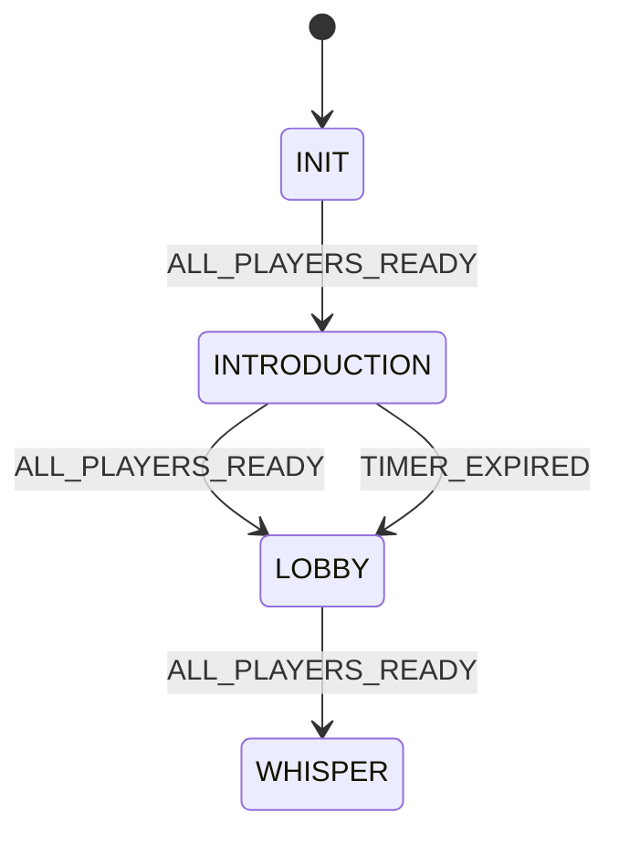

# Influence Game ‑ XState v5 Architecture

> **Status:** Draft ❘ **Author:** elizaOS core team ❘ **Last Updated:** <!-- CURSOR-DATE -->

---

## 1. Motivation

The existing `GameState` object and ad-hoc helpers (e.g. `transitionToPhase`, `updateIntroduction`) are difficult to extend.  
XState v5 provides:

- **Executable diagrams** – perfect for a complex, phase-driven social game.
- **Actors** – let us split `GameState`, `RoomState`, `HouseState`, and `PlayerState` into truly independent, testable services.
- **Strong TS types** – compile-time guarantees instead of fragile casts & `any` fields.

This document proposes a clean XState v5 architecture that plugs into ElizaOS services without coupling persistence to control-flow.

---

## 2. Actor Hierarchy (high-level)


- **GameMachine** – single source of truth for phase/round timers.
- **RoomMachine** – encapsulates chat-room specific rules (e.g. WHISPER DM restrictions).
- **HouseMachine** – the _MC_; interacts with ElizaOS `IAgentRuntime`, sends coordination events.
- **PlayerMachine** – local to each agent runtime; consumes public/game events, decides actions.

All machines communicate **only** via typed events – no shared mutable state.

---

## 3. Shared Types

```ts
// events.ts
export enum Phase {
  INIT,
  INTRODUCTION,
  INTRO_DR,
  LOBBY,
  LOBBY_DR,
  WHISPER,
  WHISPER_DR,
  RUMOR,
  RUMOR_DR,
  VOTE,
  VOTE_DR,
  POWER,
  POWER_DR,
  REVEAL,
  REVEAL_DR,
}

export type PhaseEvent =
  | { type: "ALL_PLAYERS_READY" }
  | { type: "TIMER_EXPIRED" }
  | { type: "START_GAME"; payload: { players: UUID[] } }
  | { type: "PLAYER_JOINED"; playerId: UUID }
  | { type: "PLAYER_LEFT"; playerId: UUID };

export interface GameContext {
  phase: Phase;
  round: number;
  players: Record<UUID, PlayerMeta>;
  timers: GameTimers;
}
```

> ⚠️ **No casts**. All machine definitions will consume these exact types via `setup({ types: { context, events } })`.

---

## 4. GameMachine – top-level statechart



Key design points:

1. **Per-phase entry actions** schedule timers _without_ persisting; saving is handled by a subscribe hook.
2. **Guards** ensure `players.length >= settings.minPlayers` before leaving `INIT`.
3. **History** lives in ElizaOS DB – the machine merely emits `GAME_STATE_CHANGED`.

### Skeleton (TypeScript – XState v5)

```ts
export const gameMachine = setup({
  types: { context: {} as GameContext, events: {} as PhaseEvent },
})
  .createMachine({
    id: "game",
    context: initialGameContext,
    initial: Phase.INIT,
    states: {
      [Phase.INIT]: {
        on: {
          PLAYER_JOINED: { actions: "addPlayer" },
          ALL_PLAYERS_READY: {
            guard: "hasMinPlayers",
            target: Phase.INTRODUCTION,
          },
        },
      },
      [Phase.INTRODUCTION]: {
        entry: ["startIntroductionTimer", "notifyHouse"],
        on: {
          ALL_PLAYERS_READY: Phase.LOBBY,
          TIMER_EXPIRED: Phase.LOBBY,
        },
        exit: "resetIntroCounters",
      },
      // … other phases …
    },
  })
  .with({
    actions: {
      addPlayer: assign({
        players: ({ context }, { playerId }) => ({
          ...context.players,
          [playerId]: { joinedAt: Date.now(), status: "alive" },
        }),
      }),
      startIntroductionTimer: ({ context }) => {
        // schedule side-effect in service layer
        timerService.schedule("TIMER_EXPIRED", context.timers.intro);
      },
    },
    guards: {
      hasMinPlayers: ({ context }) =>
        Object.keys(context.players).length >= context.timers.minPlayers,
    },
  });
```

> **Persistence** – subscribe to state changes and use `saveGameState(runtime, ctx)`. The machine itself never calls I/O.

---

## 5. RoomMachine

- Spawned per Discord-like channel.
- Controls DM permissions, max message counts, media allowance.
- Listens to `GAME.PHASE_CHANGED` to adjust its own internal mode (`public`, `dm`, `rumor_image_allowed`, …).

```ts
context: { id: roomId, allowedSenders: UUID[] }

states: {
  closed: { on: { PHASE_OPEN: 'open' } },
  open: {
    entry: 'enableChannelMessaging',
    on: { PHASE_CLOSE: 'closed' },
  },
}
```

---

## 6. HouseMachine

- Actor inside House agent runtime.
- Subscribes to GameMachine (via emitted events on the message-bus) and drives:
  - Prompting players (`ARE_YOU_READY?`).
  - Emitting `ALL_PLAYERS_READY` when needed.
  - Running _diary room_ side-quests.

It imports `IAgentRuntime` **only** for performing actions (sending messages or writing memories). Logic remains testable without ElizaOS by mocking the runtime.

---

## 7. PlayerMachine

Lives inside every participant agent.

1. Consumes broadcast events (`PHASE_CHANGED`, `ARE_YOU_READY`, etc.).
2. Maintains _personal_ context (trust graph, alliances, past commitments).
3. Decides when to dispatch ElizaOS **actions** (e.g. `sendWhisper`, `castVote`).

> Because PlayerMachine is private to the agent, trust scores and relationship graphs remain secret.

---

## 8. Persistence Strategy

- **Injection** – initial context passed at `createActor(gameMachine, { snapshot })`. Snapshot loaded via `getGameState(runtime, roomId)`.
- **Decoupled Saving** – subscribe to actor `.onTransition` & dispatch `saveGameState()` when `state.changed === true`.
- **Failure recovery** – on crash, reload snapshot ➜ deterministic replay ensures no duplicate side-effects.

---

## 9. Implementation Roadmap

| Phase | Task                                                                   | Owner    | Notes                                     |
| ----- | ---------------------------------------------------------------------- | -------- | ----------------------------------------- |
| 1     | Define shared `events.ts`, `context.ts`™ types                        | Core     | **No casts** – leverage XState type-gen   |
| 2     | Implement `gameMachine` (happy path INIT → LOBBY)                      | Core     | Unit tests with vitest                    |
| 3     | Build `StateMachineService` wrapper (start/stop, persistence)          | Core     | Replace legacy helper functions           |
| 4     | Refactor House plugin to spawn `HouseMachine` & listen to `gameEvent$` | House    | side-effects via runtime API              |
| 5     | Create `RoomMachine`; integrate with ChannelManager hooks              | Server   | controls DM rules                         |
| 6     | Migrate player agents to `PlayerMachine`                               | Gameplay | may be iterative – start with INTRO/Lobby |
| 7     | Extend GameMachine with WHISPER → REVEAL phases & timers               | Core     | ensure guards & parallel diary states     |
| 8     | Write E2E tests (`bun run test:e2e`) for full round loop               | QA       | use ConversationSimulator                 |
| 9     | Remove old `transitionToPhase` etc., clean dead code                   | Cleanup  | ensure all tests green                    |

---

## 10. Open Questions / Gaps

1. **Timer Service** – central debounce / cancel abstraction needed; can be an ElizaOS Service.
2. **Distributed Consensus** – if multiple runtime instances of House exist (HA), how to ensure single authority? Out-of-scope for MVP.
3. **Hot Reload** – XState snapshot API supports; we must store snapshots separately from high-level `game_state` memory to avoid bloat.
4. **Mermaid visualizer** – integrate into docs pipeline for live diagrams.

---

## 11. Conclusion

Adopting XState v5 formalizes Influence’s complex, asynchronous phase logic into maintainable, visual actors.  
This architecture isolates persistence, improves testability, and aligns with ElizaOS plugin best-practices.

_Next step: implement `events.ts` & a minimal `gameMachine` with INIT ➜ INTRODUCTION ➜ LOBBY transitions._
